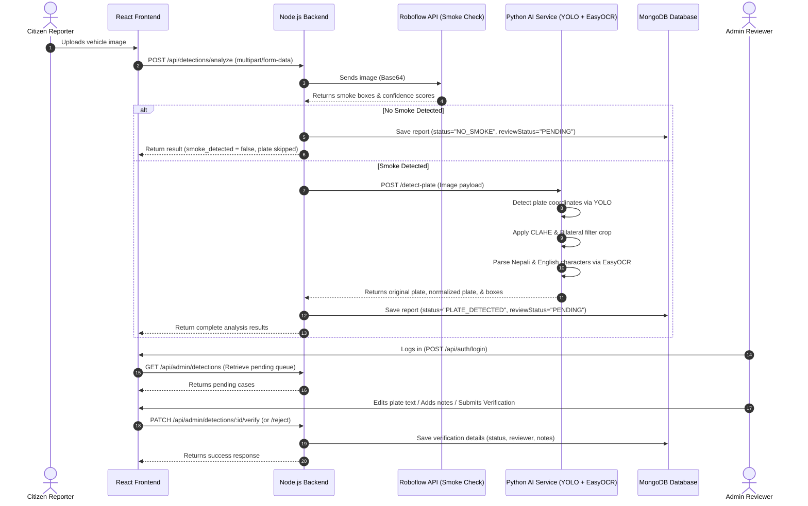
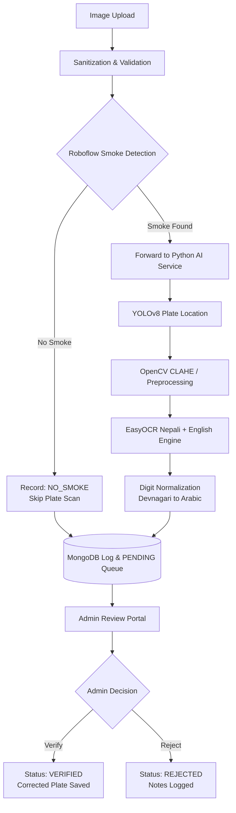

# SmokePlate AI - Vehicle Smoke Detection & License Plate Recognition

SmokePlate AI is an automated, AI-driven vehicle emission monitoring and license plate recognition system designed to automate public emission tracking and audit reports. This document serves as the project proposal, technical workflow specification, and deployment guide for the system.

---

## 1. Executive Summary & Problem Statement

### 1.1 Context & Problem Statement
Uncontrolled vehicle emissions are a major contributor to urban air pollution. Traditional methods of identifying polluting vehicles require manual checkpoint inspections or traffic officer intervention, which are resource-intensive, intermittent, and difficult to scale. Furthermore, identifying violating vehicle license plates from a distance, translating varying scripts (such as Nepali Devnagari and Arabic numerals), and verifying reports manually creates an administrative bottleneck.

### 1.2 Proposed Solution
**SmokePlate AI** addresses these problems by providing a unified, full-stack workflow:
1. **Public Reporting Portal**: A React/Vite-based client interface allowing citizens to upload images of vehicles emitting heavy exhaust.
2. **Tier-1 Smoke Detection**: Real-time cloud segmentation and classification of visible smoke fumes using Roboflow APIs.
3. **Tier-2 License Plate Recognition & OCR**: A dedicated Python FastAPI microservice utilizing YOLOv8 object detection and EasyOCR (Nepali and English script parsing) to automatically locate and read license plates of violating vehicles.
4. **Centralized Admin Verification Dashboard**: A MERN backend (Node.js/Express.js + MongoDB) storing records under a secure status state-machine where environmental regulators can audit, verify, correct OCR reads, and flag emission violations.

For additional system requirements, refer to the full product requirements in [prd.md](file:///D:/Quad-Core/prd.md).

---

## 2. Core Technical Workflows

The lifecycle of an uploaded image and its subsequent audit trail follows a structured sequence of analysis and review:

### 2.1 Workflow Sequence Chart



### 2.2 Data-Flow Processing Phases



#### Phase 1: Ingestion & Input Sanitization
* The React client uploads the file via multipart form-data.
* The Node.js controller validates that the payload complies with file size constraints (max 10MB) and formats (`.jpg`, `.jpeg`, `.png`, `.webp`).
* Upload routes are orchestrated in [app.js](file:///D:/Quad-Core/backend/src/app.js).

#### Phase 2: Tier-1 Smoke Detection (Roboflow)
* The Express server parses the image and submits it to Roboflow.
* The response contains bounded box predictions and confidence percentages for the target class `smoke`.
* If no smoke detections meet the confidence threshold, plate recognition is bypassed to save ML resources.

#### Phase 3: Tier-2 License Plate & OCR Extraction (FastAPI Service)
* For smoke-positive images, the Express backend pipes the image buffer to the Python FastAPI microservice.
* **YOLOv8 Plate Detection**: Locates coordinates of the Nepal vehicle license plate in the frame.
* **OpenCV Preprocessing**: Crops the plate segment and applies CLAHE (Contrast Limited Adaptive Histogram Equalization) and bilateral filtering to normalize lighting and reduce noise.
* **EasyOCR Engine**: Runs optical character recognition with dual-language support (Nepali `ne` + English `en`).
* **Digit Normalization**: Devnagari numbers are programmatically converted to Arabic digits (e.g., `१२३४` $\rightarrow$ `1234`) to align with administrative databases.

#### Phase 4: Persistence & Database Logging
* Data is structured according to the Mongoose schemas and logged in MongoDB.
* The default status of all new records is flagged as `reviewStatus = PENDING`.

#### Phase 5: Verification, Audit Trail & Administrative Lifecycle
* Authorized administrators access the verified queue via JWT Bearer Authentication.
* Reviewers can view side-by-side cropped images, AI-detected plate texts, and confidence stats.
* Admins submit corrections for misread text, add comments, and verify/reject the report. This updates the database with reviewer details and timestamps for an immutable audit trail.

---

## 3. Project Directory Structure

The codebase is organized into independent services to isolate concern and facilitate scalability:

```text
Quad-Core/
├── frontend/             # React (Vite) client interface with Tailwind CSS v4
├── backend/              # Node.js + Express.js workflow orchestrator & API gateway
├── python-service/       # Python FastAPI AI microservice for YOLOv8 & EasyOCR
├── README.md             # Project proposal & workflow specifications
├── prd.md                # System requirements & API contracts
└── .gitignore            # Root Git configurations
```

* **Frontend Portal**: Located in [frontend/](file:///D:/Quad-Core/frontend).
* **Backend Orchestration Gateway**: Located in [backend/](file:///D:/Quad-Core/backend).
* **Python Machine Learning Microservice**: Located in [python-service/](file:///D:/Quad-Core/python-service).

---

## 4. Technical Stack Breakdown

| Module | Technology | Role / Purpose |
| :--- | :--- | :--- |
| **User Interface** | React 19 (Vite) + Tailwind CSS v4 | High-fidelity responsive user interface, upload dashboard, and admin review queue. |
| **API Gateway & Orchestration** | Node.js (Express.js) | Authentication, file routing via Multer, Roboflow API integration, Python service forwarding, and role verification. |
| **Database** | MongoDB + Mongoose | Document database for storing reports, user models, bounding boxes, and admin audit comments. |
| **AI Inference Wrapper** | Python FastAPI (Uvicorn) | High-performance async microservice exposing object detection and character recognition pipelines. |
| **Object Detection Model** | YOLOv8 (Ultralytics) | Loaded from Hugging Face (`krishnamishra8848/Nepal-Vehicle-License-Plate-Detection`) to find license plate positions. |
| **OCR Processing Engine** | EasyOCR | Multilingual text extraction from the cropped plate segments. |
| **Image Preprocessing** | OpenCV | Image cropping, CLAHE grayscale normalization, and bilateral filtering. |

---

## 5. Setup & Implementation Guide

Follow these steps to run all components of the system locally for evaluation:

### 5.1 Database Environment
Start your local MongoDB instance. In Windows, this can be run as a background service:
```bash
net start MongoDB
```
Or start the server via local binary path if it is not configured as a service:
```bash
mongod --dbpath "C:\data\db"
```

### 5.2 Express Backend Setup
1. Navigate to the backend directory:
   ```bash
   cd backend
   ```
2. Install Node dependencies:
   ```bash
   npm install
   ```
3. Configure environment properties in [backend/.env](file:///D:/Quad-Core/backend/.env) (use `backend/.env.example` as a template).
4. Run the seed script to create the default administrator user:
   ```bash
   npm run seed:admin
   ```
5. Start the development server:
   ```bash
   npm run dev
   ```

### 5.3 Python AI Microservice Setup
1. Navigate to the Python microservice directory:
   ```bash
   cd python-service
   ```
2. Initialize and activate a Python virtual environment:
   ```bash
   python -m venv .venv
   # Windows PowerShell:
   .venv\Scripts\activate
   ```
3. Install dependencies from [requirements.txt](file:///D:/Quad-Core/python-service/requirements.txt):
   ```bash
   pip install -r requirements.txt
   ```
4. Start the FastAPI microservice on port 8000:
   ```bash
   uvicorn app.main:app --reload --port 8000
   ```
   > [!NOTE]
   > On its initial execution, the service downloads the EasyOCR models and the YOLO plate detection model from Hugging Face. This may take a few minutes depending on network bandwidth.

### 5.4 Frontend Portal Setup
1. Navigate to the frontend directory:
   ```bash
   cd frontend
   ```
2. Install dependencies:
   ```bash
   npm install
   ```
3. Start the local Vite server:
   ```bash
   npm run dev
   ```
4. Access the web interface at `http://localhost:5173`.

---

## 6. Access Control & Authorization

To verify features and test administrative actions:
* Navigate to the **Admin Portal** or visit `http://localhost:5173/admin/login` directly.
* Use the default admin credentials:
  * **Email**: `admin@smokeplate.ai`
  * **Password**: `Admin@12345`

> [!WARNING]
> **Production Security Note:** The default credentials seeded are intended for development testing only. In production environments, passwords must be rotated immediately inside MongoDB using bcryptjs hashing.

---

## 7. Non-Functional Safeguards & System Resilience

1. **API Key Isolation**: Secrets (e.g., Roboflow Workspace Tokens and JWT Keys) are isolated within backend environment variables and never parsed in frontend scripts.
2. **Graceful Degradation & Fallbacks**: If the FastAPI ML server goes offline, the Node.js backend handles socket connection errors gracefully, marks the report status as `SMOKE_DETECTED` with an OCR explanation of `performed: false`, and logs the error details, allowing the user flow to complete.
3. **Admin Audit Trails**: Modification of records requires role-verification. The `adminReview` object logs the administrator's ID and timestamps to establish non-repudiation.
4. **Data Input Validation**: Multer blocks invalid MIME types and enforces a strict file-size limit on the server-side, preventing buffer overflow and storage exhaustion attacks.